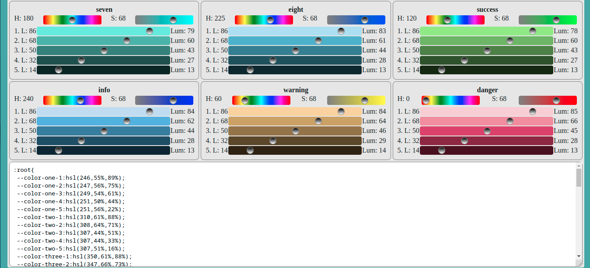

# A Simple Color Palette Generator

This is a pet project to generate palette of some random colors.

## Used Tech

- `Svelte`
- `Vite`

## Build and Run

```bash
# Install dependencies
yarn

# Build
yarn build

# Run dev server
yarn dev
```

### [Open Demo Page](http://chitholian.github.io/theme-generator/)

## Screenshots



